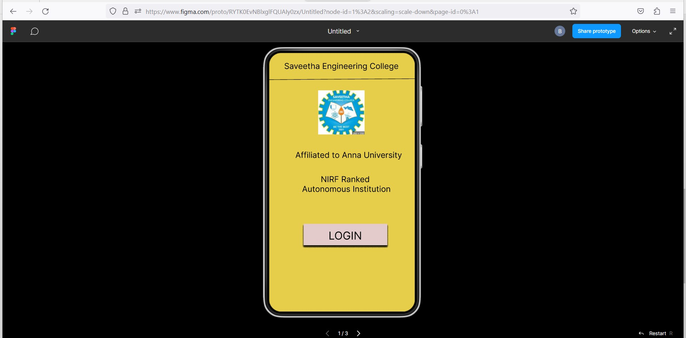
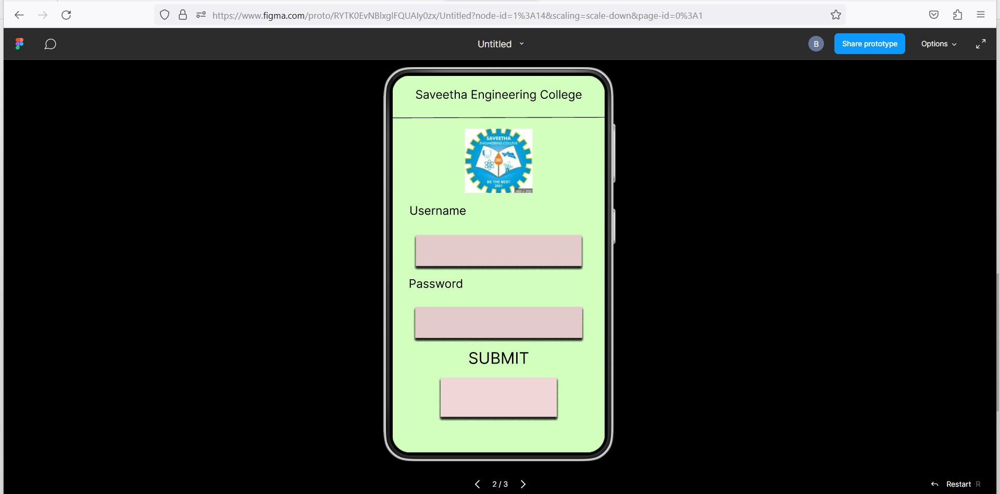
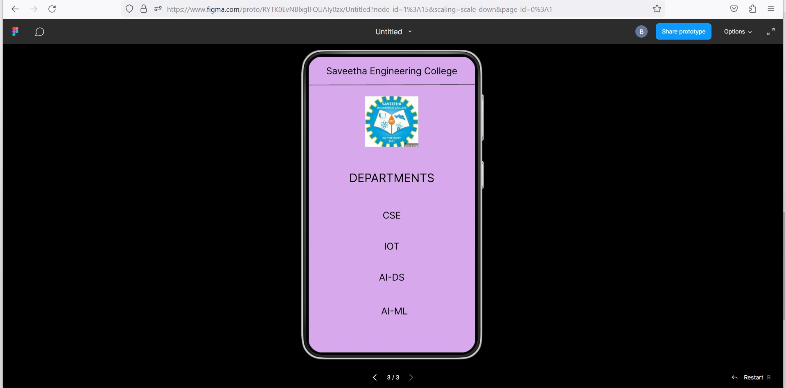

# Event Registration Web Application

## AIM:
To design, develop and deploy a web application for event registration.

## DESIGN STEPS:

### Step 1:
Create a new frame.

### Step 2:
Select any one preset size of your choice.

### Step 3:
Select the shapes you need.

### Step 4:
Import images as needed.

### Step 5:
Create pages based on your need and link them.

### Step 6:

Validate the HTML and CSS code.

### Step 6:

Publish the website in the given URL.

## DESIGN:
Figma

## PROGRAM :
```
/* Home Page */

position: relative;
width: 378px;
height: 640px;
background: #E7CE4A;


/* Login Page */

/* Auto layout */
display: flex;
flex-direction: column;
align-items: center;
padding: 20px 0px;
gap: 18px;
position: relative;
width: 360px;
height: 640px;
background: #D3FFBE;


/* SEC Page */

position: relative;
width: 360px;
height: 640px;
background: #D7A9EC;

/* Saveetha Engineering College */

position: absolute;
width: 327px;
height: 33px;
left: 15px;
top: 21px;
font-family: 'Inter';
font-style: normal;
font-weight: 400;
font-size: 20px;
line-height: 24px;
text-align: center;
color: #000000;

/* DEPARTMENTS */

position: absolute;
width: 327px;
height: 33px;
left: 16px;
top: 247px;
font-family: 'Inter';
font-style: normal;
font-weight: 400;
font-size: 25px;
line-height: 30px;
text-align: center;
color: #000000;

/* CSE */

position: absolute;
width: 327px;
height: 33px;
left: 16px;
top: 331px;
font-family: 'Inter';
font-style: normal;
font-weight: 400;
font-size: 20px;
line-height: 24px;
text-align: center;
color: #000000;
```

## OUTPUT:




## Result:
The program to design, develop and deploy a web application for event registration is completed successfully.
